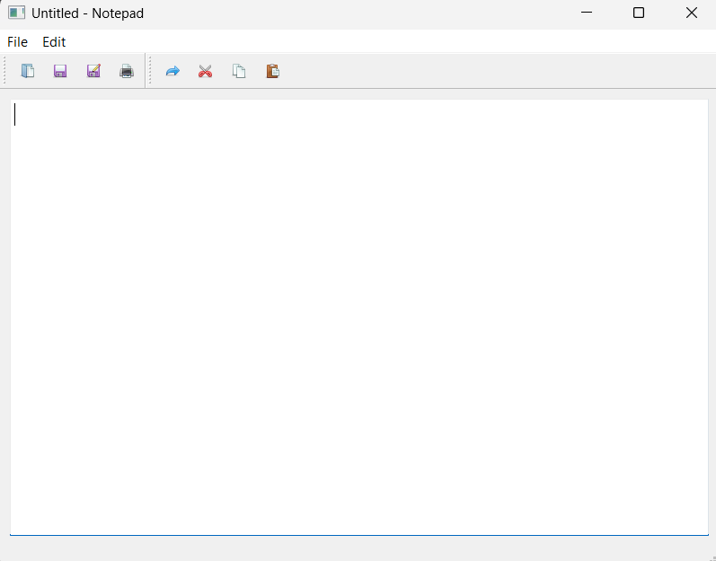
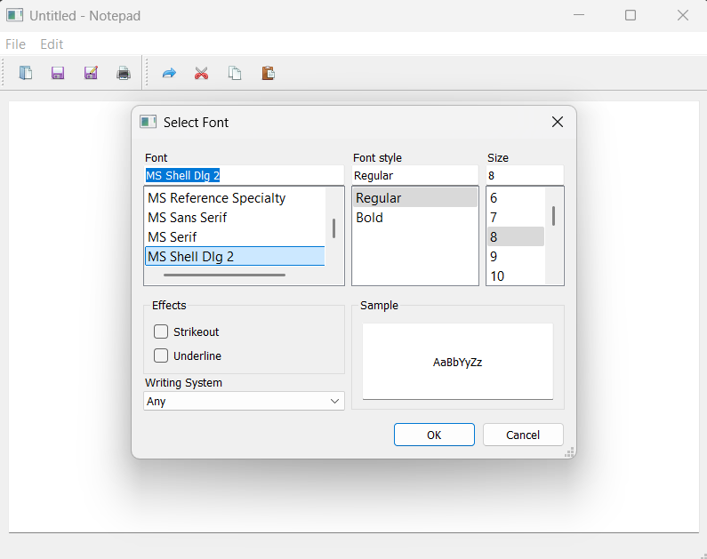
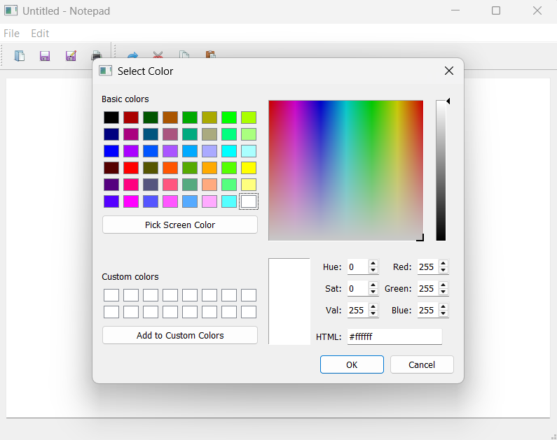

# Notepad



A simple, feature-rich Notepad application built using **PyQt5** with functionalities such as file handling, text formatting, printing, and editing tools.

## Installation

Ensure that Python and PyQt5 or PyQt6 are installed on your system.

### Prerequisites

- PyQt5 or PyQt6

### Install PyQt5 or PyQt6

```bash
pip install PyQt5
```
or 
```bash
pip install PyQt6
```

## Usage

Clone the repository and run the script:

```bash
git clone https://github.com/jeelmoradiya/Notepad.git
cd PyQt5-Notepad
python notepad.py
```

## Screenshots

### Font Selection


### Color Picker


## File Operations

1. **Open File**: Load an existing text document.
2. **Save File**: Save changes to the current document.
3. **Save As**: Save the document with a new filename.
4. **Print Document**: Send the document to the printer.

## Editing Options

- **Undo/Redo**: Revert or redo last actions.
- **Cut/Copy/Paste**: Standard clipboard operations.
- **Select All**: Highlight all text.

## Formatting Options

- **Font Selection**: Choose a custom font for text.
- **Text Color**: Modify text color.
- **Word Wrap**: Toggle text wrapping within the window.

## How It Works

The application is built using **QMainWindow** and integrates:

- **QPlainTextEdit** for the text editor.
- **QToolBar** for quick access icons.
- **QMenuBar** for file and edit operations.
- **QFileDialog, QColorDialog, QFontDialog** for file and text customization dialogs.
- **QStatusBar** for displaying application status.

## Customization

You can modify the icons by replacing images in the `images/` directory with your preferred ones.

## Author

[Jeel Moradiya](https://github.com/jeelmoradiya)

